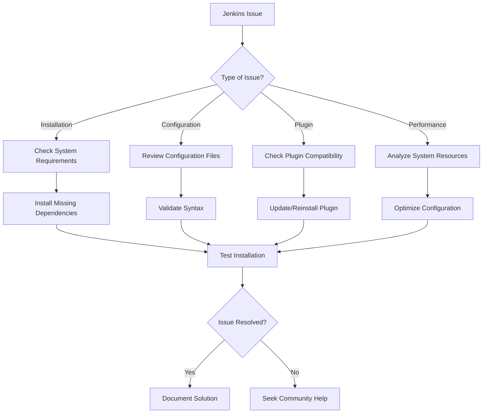

# 🚀 Jenkins Documentation Hub

[](https://jenkins.io/)
[](https://github.com/yourusername/jenkins-docs)
[](https://opensource.org/licenses/MIT)
[](CONTRIBUTING.md)

> **A comprehensive, community-driven documentation project for Jenkins CI/CD automation platform**

Welcome to the most complete Jenkins documentation resource! This repository provides in-depth guides, best practices, troubleshooting solutions, and real-world examples to help you master Jenkins from beginner to expert level.

---

## 📚 Table of Contents

- [🌟 Features](#-features)
- [🚀 Quick Start](#-quick-start)
- [📖 Documentation Structure](#-documentation-structure)
- [💻 Installation Methods](#-installation-methods)
- [🔧 Configuration](#-configuration)
- [📋 Prerequisites](#-prerequisites)
- [🛠️ Advanced Topics](#️-advanced-topics)
- [📱 API Reference](#-api-reference)
- [🤝 Contributing](#-contributing)
- [🆘 Support & Troubleshooting](#-support--troubleshooting)
- [📜 License](#-license)
- [🙏 Acknowledgments](#-acknowledgments)

---

## 🌟 Features

### 📖 Comprehensive Coverage
- **Complete Installation Guides** - Multiple installation methods across different platforms
- **Pipeline Documentation** - Declarative and Scripted pipelines with examples
- **Plugin Management** - 500+ plugin configurations and best practices
- **Security Hardening** - Enterprise-grade security configurations
- **Performance Optimization** - Scaling and performance tuning strategies

### 🎯 Practical Examples
- **Real-world Use Cases** - Industry-specific CI/CD implementations
- **Code Samples** - Copy-paste ready configurations
- **Step-by-step Tutorials** - Hands-on learning approach
- **Video Walkthroughs** - Visual learning resources
- **Interactive Demos** - Try before you implement

### 🔧 Advanced Features
- **Multi-branch Pipelines** - GitFlow and GitHub Flow implementations
- **Blue Ocean Integration** - Modern UI setup and configuration
- **Kubernetes Integration** - Cloud-native Jenkins deployments
- **Docker Support** - Containerized Jenkins environments
- **Monitoring & Alerting** - Comprehensive observability setup

---

## 🚀 Quick Start

### For Beginners
```bash
# Clone the documentation
git clone https://github.com/yourusername/jenkins-docs.git
cd jenkins-docs

# Start with the basics
1. Read: docs/getting-started/README.md
2. Follow: docs/installation/quick-setup.md
3. Try: examples/hello-world-pipeline/
```

### For Experienced Users
```bash
# Jump to advanced topics
1. Architecture: docs/architecture/distributed-builds.md
2. Security: docs/security/enterprise-setup.md
3. Scaling: docs/performance/high-availability.md
```

---

## 📖 Documentation Structure

```
jenkins-docs/
├── 📁 docs/
│   ├── 🚀 getting-started/
│   │   ├── overview.md                 # Jenkins fundamentals
│   │   ├── key-concepts.md            # Core concepts explained
│   │   └── first-job.md               # Your first Jenkins job
│   │
│   ├── ⚙️ installation/
│   │   ├── linux/
│   │   │   ├── ubuntu-debian.md       # Ubuntu/Debian installation
│   │   │   ├── centos-rhel.md         # CentOS/RHEL installation
│   │   │   └── arch-linux.md          # Arch Linux installation
│   │   ├── windows/
│   │   │   ├── windows-service.md     # Windows service setup
│   │   │   └── chocolatey.md          # Chocolatey installation
│   │   ├── macos/
│   │   │   ├── homebrew.md            # Homebrew installation
│   │   │   └── manual-setup.md        # Manual macOS setup
│   │   ├── docker/
│   │   │   ├── docker-compose.md      # Docker Compose setup
│   │   │   ├── kubernetes.md          # Kubernetes deployment
│   │   │   └── helm-charts.md         # Helm chart installation
│   │   └── cloud/
│   │       ├── aws-ec2.md             # AWS EC2 deployment
│   │       ├── azure-vm.md            # Azure VM deployment
│   │       └── gcp-compute.md         # GCP Compute Engine
│   │
│   ├── 🔄 pipelines/
│   │   ├── declarative/
│   │   │   ├── syntax-guide.md        # Declarative syntax
│   │   │   ├── advanced-features.md   # Advanced declarative features
│   │   │   └── best-practices.md      # Declarative best practices
│   │   ├── scripted/
│   │   │   ├── groovy-basics.md       # Groovy scripting basics
│   │   │   ├── advanced-scripting.md  # Advanced scripting
│   │   │   └── migration-guide.md     # Scripted to Declarative migration
│   │   ├── multibranch/
│   │   │   ├── setup-guide.md         # Multibranch setup
│   │   │   ├── github-integration.md  # GitHub integration
│   │   │   └── gitlab-integration.md  # GitLab integration
│   │   └── shared-libraries/
│   │       ├── creating-libraries.md  # Creating shared libraries
│   │       ├── library-structure.md   # Library organization
│   │       └── testing-libraries.md   # Testing shared libraries
│   │
│   ├── 🔌 plugins/
│   │   ├── essential/
│   │   │   ├── git-plugin.md          # Git plugin configuration
│   │   │   ├── pipeline-plugin.md     # Pipeline plugin features
│   │   │   └── blue-ocean.md          # Blue Ocean setup
│   │   ├── build-tools/
│   │   │   ├── maven-integration.md   # Maven plugin
│   │   │   ├── gradle-plugin.md       # Gradle plugin
│   │   │   └── nodejs-plugin.md       # Node.js plugin
│   │   ├── deployment/
│   │   │   ├── deploy-to-container.md # Container deployment
│   │   │   ├── aws-deployment.md      # AWS deployment plugins
│   │   │   └── kubernetes-deploy.md   # Kubernetes deployment
│   │   └── monitoring/
│   │       ├── build-monitor.md       # Build monitoring
│   │       ├── prometheus-plugin.md   # Prometheus integration
│   │       └── slack-notifications.md # Slack notifications
│   │
│   ├── 🔒 security/
│   │   ├── authentication/
│   │   │   ├── ldap-setup.md          # LDAP authentication
│   │   │   ├── saml-configuration.md  # SAML setup
│   │   │   └── oauth-providers.md     # OAuth integration
│   │   ├── authorization/
│   │   │   ├── matrix-security.md     # Matrix-based security
│   │   │   ├── role-strategy.md       # Role-based access
│   │   │   └── project-security.md    # Project-level security
│   │   └── hardening/
│   │       ├── security-checklist.md  # Security checklist
│   │       ├── csp-configuration.md   # Content Security Policy
│   │       └── audit-logging.md       # Audit logging setup
│   │
│   ├── 🏗️ architecture/
│   │   ├── master-slave.md            # Master-slave architecture
│   │   ├── distributed-builds.md      # Distributed build setup
│   │   ├── high-availability.md       # HA configuration
│   │   └── backup-strategies.md       # Backup and restore
│   │
│   ├── 📊 monitoring/
│   │   ├── metrics-collection.md      # Metrics and monitoring
│   │   ├── log-management.md          # Log aggregation
│   │   ├── alerting-setup.md          # Alert configuration
│   │   └── performance-tuning.md      # Performance optimization
│   │
│   └── 🆘 troubleshooting/
│       ├── common-issues.md           # Common problems & solutions
│       ├── debugging-pipelines.md     # Pipeline debugging
│       ├── performance-issues.md      # Performance troubleshooting
│       └── log-analysis.md            # Log analysis techniques
│
├── 📁 examples/
│   ├── basic-pipelines/
│   │   ├── hello-world/               # Simple pipeline example
│   │   ├── java-maven/                # Java Maven build
│   │   └── nodejs-app/                # Node.js application
│   ├── advanced-pipelines/
│   │   ├── microservices/             # Microservices pipeline
│   │   ├── full-stack-app/            # Full-stack deployment
│   │   └── mobile-app/                # Mobile app CI/CD
│   └── integrations/
│       ├── github-actions/            # GitHub Actions integration
│       ├── gitlab-ci/                 # GitLab CI integration
│       └── azure-devops/              # Azure DevOps integration
│
├── 📁 scripts/
│   ├── installation/                  # Installation scripts
│   ├── backup/                        # Backup scripts
│   ├── monitoring/                    # Monitoring scripts
│   └── utilities/                     # Utility scripts
│
├── 📁 templates/
│   ├── Jenkinsfile-templates/         # Pipeline templates
│   ├── job-configs/                   # Job configuration templates
│   └── docker-compose/               # Docker Compose templates
│
└── 📁 assets/
    ├── images/                        # Documentation images
    ├── videos/                        # Tutorial videos
    └── diagrams/                      # Architecture diagrams
```

---

## 💻 Installation Methods

### 🐧 Linux Distributions

#### Ubuntu/Debian
```bash
# Using official Jenkins repository
wget -q -O - https://pkg.jenkins.io/debian/jenkins.io.key | sudo apt-key add -
sudo sh -c 'echo deb http://pkg.jenkins.io/debian-stable binary/ > /etc/apt/sources.list.d/jenkins.list'
sudo apt update
sudo apt install jenkins
```

#### CentOS/RHEL
```bash
# Using YUM repository
sudo wget -O /etc/yum.repos.d/jenkins.repo https://pkg.jenkins.io/redhat-stable/jenkins.repo
sudo rpm --import https://pkg.jenkins.io/redhat-stable/jenkins.io.key
sudo yum install jenkins
```

### 🪟 Windows

#### Method 1: Windows Installer
1. Download the [Windows Installer](https://jenkins.io/download/)
2. Run the installer as Administrator
3. Follow the setup wizard

#### Method 2: Chocolatey
```powershell
# Install using Chocolatey
choco install jenkins
```

### 🍎 macOS

#### Homebrew Installation
```bash
# Install using Homebrew
brew install jenkins-lts
brew services start jenkins-lts
```

### 🐳 Docker Deployment

#### Simple Docker Run
```bash
# Quick start with Docker
docker run -d -p 8080:8080 -p 50000:50000 \
  -v jenkins_home:/var/jenkins_home \
  --name jenkins jenkins/jenkins:lts
```

#### Docker Compose
```yaml
# docker-compose.yml
version: '3.8'
services:
  jenkins:
    image: jenkins/jenkins:lts
    ports:
      - "8080:8080"
      - "50000:50000"
    volumes:
      - jenkins_home:/var/jenkins_home
    environment:
      - JAVA_OPTS=-Djenkins.install.runSetupWizard=false

volumes:
  jenkins_home:
```

### ☁️ Cloud Deployments

#### AWS EC2
- [Complete AWS EC2 Setup Guide](docs/installation/cloud/aws-ec2.md)
- [AWS ECS Deployment](docs/installation/cloud/aws-ecs.md)
- [AWS EKS with Helm](docs/installation/cloud/aws-eks.md)

#### Microsoft Azure
- [Azure VM Deployment](docs/installation/cloud/azure-vm.md)
- [Azure Container Instances](docs/installation/cloud/azure-aci.md)
- [Azure Kubernetes Service](docs/installation/cloud/azure-aks.md)

#### Google Cloud Platform
- [GCP Compute Engine](docs/installation/cloud/gcp-compute.md)
- [Google Kubernetes Engine](docs/installation/cloud/gcp-gke.md)
- [Cloud Run Deployment](docs/installation/cloud/gcp-cloud-run.md)

---

## 🔧 Configuration

### Initial Setup Checklist

- [ ] **Security Configuration**
  - [ ] Change default admin password
  - [ ] Configure authentication (LDAP/SAML/OAuth)
  - [ ] Set up authorization matrix
  - [ ] Enable CSRF protection

- [ ] **System Configuration**
  - [ ] Configure system message
  - [ ] Set up global tools (JDK, Maven, Git)
  - [ ] Configure email notifications
  - [ ] Set up backup strategy

- [ ] **Plugin Installation**
  - [ ] Essential plugins (Git, Pipeline, Blue Ocean)
  - [ ] Build tools (Maven, Gradle, Node.js)
  - [ ] Deployment plugins
  - [ ] Monitoring and notification plugins

### Environment-Specific Configurations

#### Development Environment
```groovy
// Recommended plugins for development
- Pipeline: Stage View
- Blue Ocean
- Git Plugin
- GitHub Integration
- Build Monitor View
```

#### Production Environment
```groovy
// Production-ready configuration
- Role-based Authorization Strategy
- LDAP Plugin
- Audit Trail
- Monitoring Plugins
- Backup Plugin
```

---

## 📋 Prerequisites

### System Requirements

#### Minimum Requirements
- **RAM**: 4 GB (8 GB recommended)
- **Storage**: 50 GB free space
- **CPU**: 2 cores (4 cores recommended)
- **Java**: OpenJDK 11 or 17

#### Recommended Requirements
- **RAM**: 16 GB or more
- **Storage**: 100 GB+ SSD
- **CPU**: 8 cores or more
- **Java**: OpenJDK 17 LTS
- **Network**: High-speed internet connection

### Software Dependencies

#### Required Software
```bash
# Java (OpenJDK 11 or 17)
sudo apt install openjdk-17-jdk

# Git (for source control)
sudo apt install git

# Docker (for containerized builds)
sudo apt install docker.io
```

#### Optional but Recommended
```bash
# Maven (for Java projects)
sudo apt install maven

# Node.js (for JavaScript projects)
curl -fsSL https://deb.nodesource.com/setup_18.x | sudo -E bash -
sudo apt install nodejs

# Python (for Python projects)
sudo apt install python3 python3-pip
```

---

## 🛠️ Advanced Topics

### High Availability Setup
- **Master-Slave Configuration**: [Complete Guide](docs/architecture/master-slave.md)
- **Load Balancing**: [Setup Instructions](docs/architecture/load-balancing.md)
- **Backup and Recovery**: [Best Practices](docs/architecture/backup-strategies.md)

### Security Hardening
- **Enterprise Security**: [Security Checklist](docs/security/hardening/security-checklist.md)
- **SSL/TLS Configuration**: [HTTPS Setup](docs/security/ssl-setup.md)
- **Vulnerability Management**: [Security Scanning](docs/security/vulnerability-scanning.md)

### Performance Optimization
- **Build Optimization**: [Speed Up Builds](docs/performance/build-optimization.md)
- **Resource Management**: [Resource Allocation](docs/performance/resource-management.md)
- **Caching Strategies**: [Build Caching](docs/performance/caching-strategies.md)

### Integration Patterns
- **GitOps Workflows**: [GitOps Implementation](docs/integrations/gitops.md)
- **Microservices CI/CD**: [Microservices Pipeline](docs/pipelines/microservices.md)
- **Multi-Cloud Deployment**: [Cloud-Agnostic Pipelines](docs/deployment/multi-cloud.md)

---

## 📱 API Reference

### Jenkins REST API
```bash
# Get job information
curl -X GET "http://jenkins-url/job/job-name/api/json" \
     -H "Authorization: Bearer YOUR_TOKEN"

# Trigger a build
curl -X POST "http://jenkins-url/job/job-name/build" \
     -H "Authorization: Bearer YOUR_TOKEN"

# Get build status
curl -X GET "http://jenkins-url/job/job-name/lastBuild/api/json" \
     -H "Authorization: Bearer YOUR_TOKEN"
```

### Pipeline API Examples
```groovy
// Pipeline script examples
pipeline {
    agent any
    
    stages {
        stage('Build') {
            steps {
                sh 'mvn clean compile'
            }
        }
        
        stage('Test') {
            steps {
                sh 'mvn test'
            }
        }
        
        stage('Deploy') {
            steps {
                sh 'mvn deploy'
            }
        }
    }
}
```

### Command Line Interface
```bash
# Jenkins CLI examples
java -jar jenkins-cli.jar -s http://localhost:8080/ help

# List jobs
java -jar jenkins-cli.jar -s http://localhost:8080/ list-jobs

# Build job
java -jar jenkins-cli.jar -s http://localhost:8080/ build job-name
```

---

## 🤝 Contributing

We welcome contributions from the community! Here's how you can help:

### 🔧 How to Contribute

1. **Fork the Repository**
   ```bash
   git clone https://github.com/yourusername/jenkins-docs.git
   cd jenkins-docs
   ```

2. **Create a Feature Branch**
   ```bash
   git checkout -b feature/amazing-feature
   ```

3. **Make Your Changes**
   - Add new documentation
   - Fix existing content
   - Improve examples
   - Add new use cases

4. **Commit Your Changes**
   ```bash
   git commit -m "Add: Amazing new Jenkins feature documentation"
   ```

5. **Push and Create Pull Request**
   ```bash
   git push origin feature/amazing-feature
   ```

### 📝 Contribution Guidelines

- **Documentation Standards**: Follow [Markdown best practices](STYLE_GUIDE.md)
- **Code Examples**: Ensure all code examples are tested
- **Images**: Optimize images and use descriptive alt text
- **Links**: Verify all internal and external links work
- **Language**: Use clear, concise, and inclusive language

### 🎯 Areas We Need Help With

- [ ] **Translation**: Multi-language support
- [ ] **Examples**: More real-world use cases
- [ ] **Video Content**: Tutorial videos
- [ ] **API Documentation**: Comprehensive API guides
- [ ] **Troubleshooting**: Common issues and solutions

### 🏆 Contributors

<!-- This section will be automatically updated -->
<a href="https://github.com/yourusername/jenkins-docs/graphs/contributors">
  
</a>

---

## 🆘 Support & Troubleshooting

### 🔍 Common Issues

#### Issue: Jenkins Won't Start
```bash
# Check Jenkins status
sudo systemctl status jenkins

# View Jenkins logs
sudo journalctl -u jenkins -f

# Common solution: Fix Java path
sudo systemctl edit jenkins
# Add:
# [Service]
# Environment="JAVA_HOME=/usr/lib/jvm/java-17-openjdk-amd64"
```

#### Issue: Plugin Installation Fails
```bash
# Clear plugin cache
rm -rf $JENKINS_HOME/plugins/*.jpi.pinned
rm -rf $JENKINS_HOME/plugins/*.jpi.tmp

# Restart Jenkins
sudo systemctl restart jenkins
```

#### Issue: Build Queue Stuck
```bash
# Clear build queue via script console
Jenkins.instance.queue.clear()
```

### 🆘 Getting Help

#### Community Support
- **Jenkins Community**: [community.jenkins.io](https://community.jenkins.io)
- **Stack Overflow**: Tag questions with `jenkins`
- **Reddit**: [r/jenkinsci](https://reddit.com/r/jenkinsci)
- **Discord**: [Jenkins Community Discord](https://discord.gg/jenkins)

#### Documentation Issues
- **GitHub Issues**: [Report documentation bugs](https://github.com/yourusername/jenkins-docs/issues)
- **Discussions**: [GitHub Discussions](https://github.com/yourusername/jenkins-docs/discussions)

#### Professional Support
- **CloudBees**: Enterprise Jenkins support
- **Jenkins Consulting**: Professional services directory

### 📊 Troubleshooting Flowchart



---

## 📜 License

This project is licensed under the **MIT License** - see the [LICENSE](LICENSE) file for details.

### What This Means
- ✅ **Use**: Personal and commercial use
- ✅ **Modify**: Modify the documentation
- ✅ **Distribute**: Share and distribute
- ✅ **Private Use**: Use in private projects
- ❌ **Liability**: No warranty or liability
- ❌ **Attribution**: Attribution required

```
MIT License

Copyright (c) 2024 Jenkins Documentation Contributors

Permission is hereby granted, free of charge, to any person obtaining a copy
of this software and associated documentation files (the "Software"), to deal
in the Software without restriction, including without limitation the rights
to use, copy, modify, merge, publish, distribute, sublicense, and/or sell
copies of the Software, and to permit persons to whom the Software is
furnished to do so, subject to the following conditions:

The above copyright notice and this permission notice shall be included in all
copies or substantial portions of the Software.
```

---

## 🙏 Acknowledgments

### Special Thanks

- **Jenkins Community**: For their continuous support and contributions
- **CloudBees**: For maintaining and advancing Jenkins
- **Contributors**: All the amazing people who contributed to this documentation
- **Open Source Community**: For making collaborative documentation possible

### Built With Love Using

- 📝 **Markdown**: Documentation format
- 🎨 **GitHub Pages**: Hosting platform
- 🔧 **GitHub Actions**: Automation and CI/CD
- 📊 **Mermaid**: Diagrams and flowcharts
- 🎬 **Asciinema**: Terminal recordings
- 📸 **Carbon**: Code screenshots

### Inspiration

This documentation project was inspired by:
- [Kubernetes Documentation](https://kubernetes.io/docs/)
- [Docker Documentation](https://docs.docker.com/)
- [GitLab Documentation](https://docs.gitlab.com/)

---

## 📈 Project Statistics


---

## 🚀 What's Next?

### Upcoming Features
- [ ] **Interactive Tutorials**: Hands-on learning experiences
- [ ] **Video Series**: Comprehensive video documentation
- [ ] **API Playground**: Interactive API testing
- [ ] **Mobile App**: Jenkins documentation on mobile
- [ ] **AI Assistant**: AI-powered documentation helper

### Roadmap 2024
- **Q1**: Complete installation guides for all platforms
- **Q2**: Advanced security and compliance documentation
- **Q3**: Cloud-native Jenkins patterns and practices
- **Q4**: Enterprise-grade deployment strategies

---

<div align="center">

### 🌟 Star this repository if it helped you! 🌟

**Made with ❤️ by the Jenkins Community**

[⬆ Back to Top](#-jenkins-documentation-hub)

</div>