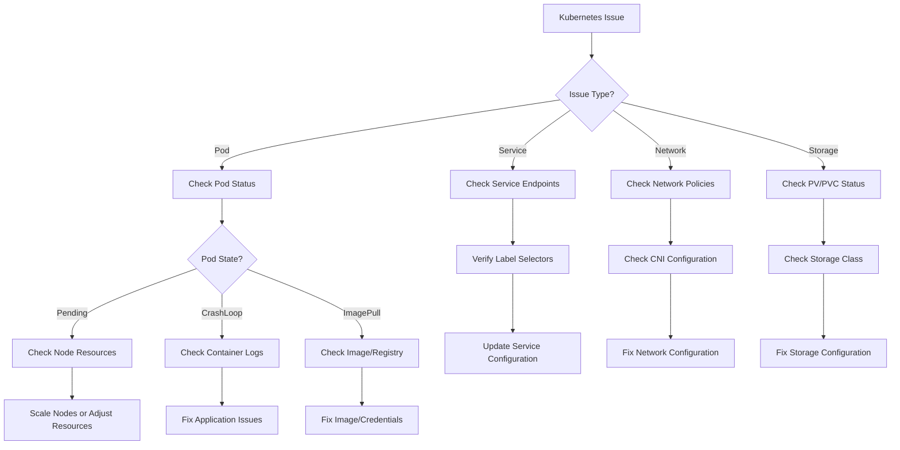

# ☸️ Kubernetes Documentation Hub

[](https://kubernetes.io/)
[](https://github.com/yourusername/kubernetes-docs)
[](https://opensource.org/licenses/MIT)
[](CONTRIBUTING.md)

> **The ultimate Kubernetes orchestration guide - From cluster basics to production-ready enterprise deployments**

Welcome to the most comprehensive Kubernetes documentation resource! This repository provides everything you need to master Kubernetes container orchestration, from fundamental concepts to advanced production deployments, security hardening, and scaling strategies.

---

## 📚 Table of Contents

- [🌟 Features](#-features)
- [🚀 Quick Start](#-quick-start)
- [📖 Documentation Structure](#-documentation-structure)
- [💻 Installation Methods](#-installation-methods)
- [🔧 Basic Commands](#-basic-commands)
- [📋 Prerequisites](#-prerequisites)
- [🛠️ Advanced Topics](#️-advanced-topics)
- [📱 Kubernetes API Reference](#-kubernetes-api-reference)
- [🤝 Contributing](#-contributing)
- [🆘 Support & Troubleshooting](#-support--troubleshooting)
- [📜 License](#-license)
- [🙏 Acknowledgments](#-acknowledgments)

---

## 🌟 Features

### 📖 Comprehensive Coverage
- **Complete Installation Guides** - All platforms and cloud providers
- **Manifest Mastery** - From basic pods to complex operators
- **Helm Charts** - Package management and templating
- **Cluster Security** - Enterprise-grade security practices
- **Production Operations** - Scaling, monitoring, and maintenance

### 🎯 Practical Examples
- **Real-world Applications** - Production-ready Kubernetes deployments
- **Multi-cloud Strategies** - AWS EKS, Azure AKS, Google GKE
- **CI/CD Integration** - GitOps workflows and automation
- **Microservices Architecture** - Service mesh and communication patterns
- **Stateful Applications** - Databases and persistent workloads

### 🔧 Advanced Features
- **Custom Resources** - CRDs and operator development
- **Network Policies** - Advanced networking and security
- **Storage Solutions** - Persistent volumes and storage classes
- **Observability** - Monitoring, logging, and tracing
- **Disaster Recovery** - Backup, restore, and HA strategies

---

## 🚀 Quick Start

### For Beginners
```bash
# Install kubectl
curl -LO "https://dl.k8s.io/release/$(curl -L -s https://dl.k8s.io/release/stable.txt)/bin/linux/amd64/kubectl"
sudo install -o root -g root -m 0755 kubectl /usr/local/bin/kubectl

# Install minikube for local development
curl -LO https://storage.googleapis.com/minikube/releases/latest/minikube-linux-amd64
sudo install minikube-linux-amd64 /usr/local/bin/minikube

# Start local cluster
minikube start

# Verify installation
kubectl version --client
kubectl cluster-info

# Start with basics
1. Read: docs/getting-started/kubernetes-overview.md
2. Follow: docs/concepts/pods-and-containers.md
3. Try: examples/hello-world-pod/
```

### For Experienced Users
```bash
# Jump to advanced topics
1. Architecture: docs/architecture/cluster-architecture.md
2. Security: docs/security/rbac-and-policies.md
3. Production: docs/production/high-availability.md
4. Operators: docs/operators/custom-resources.md
```

### Quick Commands Reference
```bash
# Essential kubectl commands
kubectl get pods                               # List pods
kubectl get services                          # List services
kubectl apply -f manifest.yaml               # Apply configuration
kubectl describe pod pod-name                # Describe resource
kubectl logs pod-name                        # View logs
kubectl exec -it pod-name -- bash           # Execute commands
kubectl delete pod pod-name                 # Delete resource
```

---

## 📖 Documentation Structure

```
kubernetes-docs/
├── 📁 docs/
│   ├── 🚀 getting-started/
│   │   ├── kubernetes-overview.md           # Kubernetes fundamentals
│   │   ├── key-concepts.md                 # Core concepts (pods, services, etc.)
│   │   ├── installation-guide.md           # Platform-specific installation
│   │   └── first-application.md            # Your first Kubernetes app
│   │
│   ├── ⚙️ installation/
│   │   ├── local-development/
│   │   │   ├── minikube-setup.md           # Minikube installation
│   │   │   ├── kind-setup.md               # Kind (Kubernetes in Docker)
│   │   │   ├── k3s-setup.md                # K3s lightweight Kubernetes
│   │   │   └── microk8s-setup.md           # MicroK8s installation
│   │   ├── cloud-managed/
│   │   │   ├── aws-eks.md                  # Amazon EKS setup
│   │   │   ├── azure-aks.md                # Azure AKS setup
│   │   │   ├── google-gke.md               # Google GKE setup
│   │   │   └── digital-ocean-k8s.md        # DigitalOcean Kubernetes
│   │   ├── self-managed/
│   │   │   ├── kubeadm-cluster.md          # Kubeadm cluster setup
│   │   │   ├── kops-aws.md                 # Kops on AWS
│   │   │   ├── kubespray.md                # Kubespray deployment
│   │   │   └── rancher-setup.md            # Rancher Kubernetes Engine
│   │   └── tools/
│   │       ├── kubectl-installation.md     # kubectl installation
│   │       ├── helm-installation.md        # Helm installation
│   │       └── essential-tools.md          # Additional tools
│   │
│   ├── 🧩 concepts/
│   │   ├── workloads/
│   │   │   ├── pods.md                     # Pod concepts and lifecycle
│   │   │   ├── deployments.md              # Deployment strategies
│   │   │   ├── replicasets.md              # ReplicaSet management
│   │   │   ├── daemonsets.md               # DaemonSet usage
│   │   │   ├── statefulsets.md             # StatefulSet for stateful apps
│   │   │   ├── jobs.md                     # Job and batch processing
│   │   │   └── cronjobs.md                 # Scheduled jobs
│   │   ├── services-networking/
│   │   │   ├── services.md                 # Service types and usage
│   │   │   ├── ingress.md                  # Ingress controllers
│   │   │   ├── network-policies.md         # Network policy configuration
│   │   │   ├── dns.md                      # DNS and service discovery
│   │   │   └── load-balancing.md           # Load balancing strategies
│   │   ├── storage/
│   │   │   ├── volumes.md                  # Volume types and usage
│   │   │   ├── persistent-volumes.md       # PV and PVC management
│   │   │   ├── storage-classes.md          # Dynamic provisioning
│   │   │   └── csi-drivers.md              # Container Storage Interface
│   │   ├── configuration/
│   │   │   ├── configmaps.md               # Configuration management
│   │   │   ├── secrets.md                  # Secret management
│   │   │   ├── environment-variables.md    # Environment configuration
│   │   │   └── resource-quotas.md          # Resource management
│   │   └── cluster-administration/
│   │       ├── namespaces.md               # Namespace organization
│   │       ├── nodes.md                    # Node management
│   │       ├── scheduling.md               # Pod scheduling
│   │       └── cluster-networking.md       # Cluster networking
│   │
│   ├── 🛡️ security/
│   │   ├── authentication/
│   │   │   ├── user-authentication.md      # User authentication methods
│   │   │   ├── service-accounts.md         # Service account management
│   │   │   ├── oidc-integration.md         # OIDC provider integration
│   │   │   └── certificate-management.md   # Certificate-based auth
│   │   ├── authorization/
│   │   │   ├── rbac.md                     # Role-Based Access Control
│   │   │   ├── cluster-roles.md            # ClusterRole and ClusterRoleBinding
│   │   │   ├── admission-controllers.md    # Admission controller configuration
│   │   │   └── webhook-authorization.md    # Webhook authorization
│   │   ├── pod-security/
│   │   │   ├── security-contexts.md        # Security context configuration
│   │   │   ├── pod-security-policies.md    # Pod Security Policies (deprecated)
│   │   │   ├── pod-security-standards.md   # Pod Security Standards
│   │   │   └── runtime-security.md         # Runtime security tools
│   │   ├── network-security/
│   │   │   ├── network-policies.md         # Network policy implementation
│   │   │   ├── service-mesh.md             # Service mesh security
│   │   │   ├── encryption.md               # Encryption in transit/at rest
│   │   │   └── firewall-integration.md     # Firewall and security groups
│   │   └── compliance/
│   │       ├── cis-benchmarks.md           # CIS Kubernetes benchmarks
│   │       ├── compliance-scanning.md      # Compliance scanning tools
│   │       ├── audit-logging.md            # Audit logging configuration
│   │       └── vulnerability-scanning.md   # Image and cluster scanning
│   │
│   ├── 🏗️ architecture/
│   │   ├── cluster-architecture/
│   │   │   ├── control-plane.md            # Control plane components
│   │   │   ├── worker-nodes.md             # Worker node components
│   │   │   ├── etcd-cluster.md             # etcd configuration and management
│   │   │   └── api-server.md               # API server configuration
│   │   ├── networking/
│   │   │   ├── cni-plugins.md              # Container Network Interface
│   │   │   ├── calico-setup.md             # Calico networking
│   │   │   ├── flannel-setup.md            # Flannel networking
│   │   │   └── cilium-setup.md             # Cilium networking
│   │   ├── storage-architecture/
│   │   │   ├── storage-backends.md         # Storage backend options
│   │   │   ├── ceph-integration.md         # Ceph storage integration
│   │   │   ├── nfs-storage.md              # NFS storage setup
│   │   │   └── cloud-storage.md            # Cloud storage integration
│   │   └── high-availability/
│   │       ├── ha-control-plane.md         # HA control plane setup
│   │       ├── load-balancer-setup.md      # Load balancer configuration
│   │       ├── backup-strategies.md        # Backup and restore strategies
│   │       └── disaster-recovery.md        # Disaster recovery planning
│   │
│   ├── 📦 package-management/
│   │   ├── helm/
│   │   │   ├── helm-basics.md              # Helm fundamentals
│   │   │   ├── chart-development.md        # Creating Helm charts
│   │   │   ├── templating.md               # Helm templating
│   │   │   ├── chart-repositories.md       # Chart repository management
│   │   │   └── helm-security.md            # Helm security best practices
│   │   ├── kustomize/
│   │   │   ├── kustomize-basics.md         # Kustomize fundamentals
│   │   │   ├── overlay-management.md       # Overlay configurations
│   │   │   ├── patch-strategies.md         # Patching strategies
│   │   │   └── integration-patterns.md     # CI/CD integration
│   │   └── operators/
│   │       ├── operator-framework.md       # Operator development framework
│   │       ├── custom-resources.md         # Custom Resource Definitions
│   │       ├── controller-development.md   # Controller development
│   │       └── operator-lifecycle.md       # Operator Lifecycle Manager
│   │
│   ├── 📊 monitoring-observability/
│   │   ├── monitoring/
│   │   │   ├── prometheus-setup.md         # Prometheus monitoring
│   │   │   ├── grafana-dashboards.md       # Grafana visualization
│   │   │   ├── alertmanager.md             # Alert management
│   │   │   └── metrics-collection.md       # Custom metrics collection
│   │   ├── logging/
│   │   │   ├── centralized-logging.md      # Centralized logging setup
│   │   │   ├── fluentd-setup.md            # Fluentd log collection
│   │   │   ├── elasticsearch-stack.md      # ELK/EFK stack setup
│   │   │   └── log-aggregation.md          # Log aggregation strategies
│   │   ├── tracing/
│   │   │   ├── distributed-tracing.md      # Distributed tracing concepts
│   │   │   ├── jaeger-setup.md             # Jaeger implementation
│   │   │   ├── zipkin-integration.md       # Zipkin integration
│   │   │   └── opentelemetry.md            # OpenTelemetry setup
│   │   └── debugging/
│   │       ├── debugging-techniques.md     # Debugging strategies
│   │       ├── performance-profiling.md    # Performance analysis
│   │       ├── resource-analysis.md        # Resource usage analysis
│   │       └── troubleshooting-tools.md    # Debugging tools
│   │
│   ├── 🔄 ci-cd-gitops/
│   │   ├── gitops/
│   │   │   ├── gitops-principles.md        # GitOps methodology
│   │   │   ├── argocd-setup.md             # ArgoCD implementation
│   │   │   ├── flux-setup.md               # Flux v2 implementation
│   │   │   └── gitops-workflows.md         # GitOps workflow patterns
│   │   ├── ci-cd-integration/
│   │   │   ├── jenkins-integration.md      # Jenkins Kubernetes integration
│   │   │   ├── github-actions.md           # GitHub Actions workflows
│   │   │   ├── gitlab-ci.md                # GitLab CI integration
│   │   │   └── tekton-pipelines.md         # Tekton pipeline setup
│   │   ├── deployment-strategies/
│   │   │   ├── rolling-deployments.md      # Rolling update strategies
│   │   │   ├── blue-green-deployment.md    # Blue-green deployments
│   │   │   ├── canary-deployment.md        # Canary deployment patterns
│   │   │   └── a-b-testing.md              # A/B testing strategies
│   │   └── automation/
│   │       ├── automated-testing.md        # Automated testing in K8s
│   │       ├── infrastructure-as-code.md   # IaC for Kubernetes
│   │       ├── policy-as-code.md           # Policy automation
│   │       └── release-automation.md       # Release automation
│   │
│   ├── 🌐 service-mesh/
│   │   ├── istio/
│   │   │   ├── istio-installation.md       # Istio setup and configuration
│   │   │   ├── traffic-management.md       # Traffic routing and control
│   │   │   ├── security-policies.md        # mTLS and security policies
│   │   │   └── observability.md            # Istio observability features
│   │   ├── linkerd/
│   │   │   ├── linkerd-setup.md            # Linkerd installation
│   │   │   ├── service-profiles.md         # Service profile configuration
│   │   │   └── monitoring-linkerd.md       # Linkerd monitoring
│   │   ├── consul-connect/
│   │   │   ├── consul-setup.md             # Consul Connect setup
│   │   │   ├── service-discovery.md        # Service discovery patterns
│   │   │   └── security-features.md        # Consul security features
│   │   └── comparison/
│   │       ├── service-mesh-comparison.md  # Service mesh comparison
│   │       ├── performance-analysis.md     # Performance benchmarks
│   │       └── selection-guide.md          # Service mesh selection guide
│   │
│   ├── 🏭 production/
│   │   ├── cluster-management/
│   │   │   ├── cluster-lifecycle.md        # Cluster lifecycle management
│   │   │   ├── node-management.md          # Node scaling and management
│   │   │   ├── upgrade-strategies.md       # Cluster upgrade procedures
│   │   │   └── maintenance-windows.md      # Maintenance planning
│   │   ├── resource-management/
│   │   │   ├── resource-quotas.md          # Resource quota management
│   │   │   ├── limit-ranges.md             # Limit range configuration
│   │   │   ├── horizontal-pod-autoscaler.md # HPA configuration
│   │   │   └── vertical-pod-autoscaler.md  # VPA configuration
│   │   ├── cost-optimization/
│   │   │   ├── resource-optimization.md    # Resource usage optimization
│   │   │   ├── cost-monitoring.md          # Cost monitoring tools
│   │   │   ├── rightsizing.md              # Workload rightsizing
│   │   │   └── spot-instances.md           # Spot instance strategies
│   │   └── performance/
│   │       ├── performance-tuning.md       # Performance optimization
│   │       ├── capacity-planning.md        # Capacity planning strategies
│   │       ├── benchmarking.md             # Performance benchmarking
│   │       └── scaling-strategies.md       # Scaling best practices
│   │
│   └── 🆘 troubleshooting/
│       ├── common-issues/
│       │   ├── pod-issues.md               # Pod troubleshooting
│       │   ├── service-issues.md           # Service connectivity issues
│       │   ├── storage-issues.md           # Storage and volume problems
│       │   └── networking-issues.md        # Network troubleshooting
│       ├── debugging-techniques/
│       │   ├── kubectl-debugging.md        # kubectl debugging commands
│       │   ├── log-analysis.md             # Log analysis techniques
│       │   ├── event-debugging.md          # Event-based debugging
│       │   └── resource-debugging.md       # Resource usage debugging
│       ├── cluster-issues/
│       │   ├── control-plane-issues.md     # Control plane troubleshooting
│       │   ├── node-issues.md              # Node troubleshooting
│       │   ├── etcd-issues.md              # etcd troubleshooting
│       │   └── dns-issues.md               # DNS troubleshooting
│       └── recovery/
│           ├── backup-recovery.md          # Backup and recovery procedures
│           ├── disaster-recovery.md        # Disaster recovery scenarios
│           └── data-recovery.md            # Data recovery strategies
│
├── 📁 examples/
│   ├── basic-applications/
│   │   ├── hello-world/                    # Simple pod and service
│   │   ├── nginx-deployment/               # Basic nginx deployment
│   │   ├── multi-container-pod/            # Multi-container pod example
│   │   └── config-and-secrets/             # ConfigMap and Secret usage
│   ├── web-applications/
│   │   ├── nodejs-app/                     # Node.js application deployment
│   │   ├── python-flask/                   # Python Flask application
│   │   ├── java-spring-boot/               # Java Spring Boot application
│   │   └── static-website/                 # Static website hosting
│   ├── databases/
│   │   ├── mysql-deployment/               # MySQL StatefulSet
│   │   ├── postgresql-cluster/             # PostgreSQL cluster
│   │   ├── mongodb-replica-set/            # MongoDB replica set
│   │   └── redis-cluster/                  # Redis cluster deployment
│   ├── microservices/
│   │   ├── microservice-demo/              # Complete microservices app
│   │   ├── api-gateway/                    # API gateway implementation
│   │   ├── service-discovery/              # Service discovery patterns
│   │   └── distributed-tracing/            # Tracing implementation
│   ├── data-processing/
│   │   ├── apache-spark/                   # Spark cluster deployment
│   │   ├── apache-kafka/                   # Kafka cluster setup
│   │   ├── data-pipeline/                  # Data processing pipeline
│   │   └── machine-learning/               # ML workload deployment
│   └── enterprise-examples/
│       ├── multi-tenant-app/               # Multi-tenant architecture
│       ├── compliance-setup/               # Compliance-ready deployment
│       ├── backup-solution/                # Backup and restore setup
│       └── monitoring-stack/               # Complete monitoring solution
│
├── 📁 manifests/
│   ├── basic-resources/                    # Basic Kubernetes manifests
│   ├── helm-charts/                        # Custom Helm charts
│   ├── kustomize-configs/                  # Kustomize configurations
│   └── operator-examples/                  # Custom operator examples
│
├── 📁 scripts/
│   ├── cluster-setup/                      # Cluster setup automation
│   ├── monitoring/                         # Monitoring setup scripts
│   ├── backup/                             # Backup automation scripts
│   ├── security/                           # Security hardening scripts
│   └── utilities/                          # General utility scripts
│
├── 📁 tools/
│   ├── kubectl-plugins/                    # Custom kubectl plugins
│   ├── automation-tools/                   # Automation and management tools
│   ├── development-tools/                  # Development utilities
│   └── debugging-tools/                    # Debugging and diagnostic tools
│
└── 📁 assets/
    ├── images/                             # Documentation images
    ├── diagrams/                           # Architecture diagrams
    ├── videos/                             # Tutorial videos
    └── cheat-sheets/                       # Quick reference guides
```

---

## 💻 Installation Methods

### 🏠 Local Development Environments

#### Minikube (Recommended for Beginners)
```bash
# Install minikube
curl -LO https://storage.googleapis.com/minikube/releases/latest/minikube-linux-amd64
sudo install minikube-linux-amd64 /usr/local/bin/minikube

# Start minikube cluster
minikube start --driver=docker --cpus=4 --memory=8192
minikube start --driver=virtualbox --cpus=4 --memory=8192

# Enable useful addons
minikube addons enable dashboard
minikube addons enable ingress
minikube addons enable metrics-server

# Access dashboard
minikube dashboard

# Stop and delete cluster
minikube stop
minikube delete
```

#### Kind (Kubernetes in Docker)
```bash
# Install kind
curl -Lo ./kind https://kind.sigs.k8s.io/dl/v0.17.0/kind-linux-amd64
chmod +x ./kind
sudo mv ./kind /usr/local/bin/kind

# Create cluster configuration
cat <<EOF > kind-config.yaml
kind: Cluster
apiVersion: kind.x-k8s.io/v1alpha4
nodes:
- role: control-plane
  kubeadmConfigPatches:
  - |
    kind: InitConfiguration
    nodeRegistration:
      kubeletExtraArgs:
        node-labels: "ingress-ready=true"
  extraPortMappings:
  - containerPort: 80
    hostPort: 80
    protocol: TCP
  - containerPort: 443
    hostPort: 443
    protocol: TCP
- role: worker
- role: worker
EOF

# Create cluster
kind create cluster --config=kind-config.yaml --name=my-cluster

# Delete cluster
kind delete cluster --name=my-cluster
```

#### K3s (Lightweight Kubernetes)
```bash
# Install K3s server
curl -sfL https://get.k3s.io | sh -

# Install K3s agent (on additional nodes)
curl -sfL https://get.k3s.io | K3S_URL=https://myserver:6443 K3S_TOKEN=mynodetoken sh -

# Get kubeconfig
sudo cp /etc/rancher/k3s/k3s.yaml ~/.kube/config
sudo chown $USER:$USER ~/.kube/config

# Uninstall K3s
/usr/local/bin/k3s-uninstall.sh
```

#### MicroK8s (Ubuntu)
```bash
# Install MicroK8s
sudo snap install microk8s --classic

# Add user to microk8s group
sudo usermod -a -G microk8s $USER
sudo chown -f -R $USER ~/.kube
newgrp microk8s

# Enable common addons
microk8s enable dashboard dns registry istio

# Get kubeconfig
microk8s config > ~/.kube/config

# Stop and start
microk8s stop
microk8s start
```

### ☁️ Cloud Managed Kubernetes

#### Amazon EKS
```bash
# Install eksctl
curl --silent --location "https://github.com/weaveworks/eksctl/releases/latest/download/eksctl_$(uname -s)_amd64.tar.gz" | tar xz -C /tmp
sudo mv /tmp/eksctl /usr/local/bin

# Create EKS cluster
eksctl create cluster \
  --name my-cluster \
  --version 1.24 \
  --region us-west-2 \
  --nodegroup-name standard-workers \
  --node-type m5.large \
  --nodes 3 \
  --nodes-min 1 \
  --nodes-max 4 \
  --managed

# Update kubeconfig
aws eks update-kubeconfig --region us-west-2 --name my-cluster

# Delete cluster
eksctl delete cluster --name my-cluster --region us-west-2
```

#### Azure AKS
```bash
# Install Azure CLI
curl -sL https://aka.ms/InstallAzureCLIDeb | sudo bash

# Login to Azure
az login

# Create resource group
az group create --name myResourceGroup --location eastus

# Create AKS cluster
az aks create \
  --resource-group myResourceGroup \
  --name myAKSCluster \
  --node-count 3 \
  --enable-addons monitoring \
  --generate-ssh-keys

# Get credentials
az aks get-credentials --resource-group myResourceGroup --name myAKSCluster

# Delete cluster
az aks delete --resource-group myResourceGroup --name myAKSCluster
```

#### Google GKE
```bash
# Install gcloud CLI
curl https://sdk.cloud.google.com | bash
exec -l $SHELL
gcloud init

# Set default project and zone
gcloud config set project PROJECT_ID
gcloud config set compute/zone us-central1-a

# Create GKE cluster
gcloud container clusters create my-cluster \
  --num-nodes=3 \
  --enable-autoscaling \
  --min-nodes=1 \
  --max-nodes=5 \
  --enable-autorepair \
  --enable-autoupgrade

# Get credentials
gcloud container clusters get-credentials my-cluster

# Delete cluster
gcloud container clusters delete my-cluster
```

### 🛠️ Self-Managed Kubernetes

#### Kubeadm Cluster Setup
```bash
# Prerequisites (run on all nodes)
sudo apt-get update
sudo apt-get install -y apt-transport-https ca-certificates curl

# Install Docker
curl -fsSL https://get.docker.com -o get-docker.sh
sudo sh get-docker.sh
sudo usermod -aG docker $USER

# Install kubeadm, kubelet, kubectl
sudo curl -fsSLo /usr/share/keyrings/kubernetes-archive-keyring.gpg https://packages.cloud.google.com/apt/doc/apt-key.gpg
echo "deb [signed-by=/usr/share/keyrings/kubernetes-archive-keyring.gpg] https://apt.kubernetes.io/ kubernetes-xenial main" | sudo tee /etc/apt/sources.list.d/kubernetes.list
sudo apt-get update
sudo apt-get install -y kubelet kubeadm kubectl
sudo apt-mark hold kubelet kubeadm kubectl

# Initialize cluster (master node only)
sudo kubeadm init --pod-network-cidr=10.244.0.0/16

# Set up kubeconfig (master node)
mkdir -p $HOME/.kube
sudo cp -i /etc/kubernetes/admin.conf $HOME/.kube/config
sudo chown $(id -u):$(id -g) $HOME/.kube/config

# Install network plugin (Flannel)
kubectl apply -f https://raw.githubusercontent.com/coreos/flannel/master/Documentation/kube-flannel.yml

# Join worker nodes (run on worker nodes)
# Use the join command from kubeadm init output
sudo kubeadm join <master-ip>:6443 --token <token> --discovery-token-ca-cert-hash sha256:<hash>
```

### 📱 Essential Tools Installation

#### kubectl
```bash
# Linux
curl -LO "https://dl.k8s.io/release/$(curl -L -s https://dl.k8s.io/release/stable.txt)/bin/linux/amd64/kubectl"
sudo install -o root -g root -m 0755 kubectl /usr/local/bin/kubectl

# macOS
brew install kubectl

# Windows (PowerShell)
curl.exe -LO "https://dl.k8s.io/release/v1.26.0/bin/windows/amd64/kubectl.exe"
```

#### Helm
```bash
# Install Helm
curl https://baltocdn.com/helm/signing.asc | gpg --dearmor | sudo tee /usr/share/keyrings/helm.gpg > /dev/null
sudo apt-get install apt-transport-https --yes
echo "deb [arch=$(dpkg --print-architecture) signed-by=/usr/share/keyrings/helm.gpg] https://baltocdn.com/helm/stable/debian/ all main" | sudo tee /etc/apt/sources.list.d/helm-stable-debian.list
sudo apt-get update
sudo apt-get install helm

# Or using script
curl -fsSL -o get_helm.sh https://raw.githubusercontent.com/helm/helm/main/scripts/get-helm-3
chmod 700 get_helm.sh
./get_helm.sh
```

---

## 🔧 Basic Commands

### Essential kubectl Commands

#### Cluster Information
```bash
# Cluster info
kubectl cluster-info
kubectl cluster-info dump

# Node information
kubectl get nodes
kubectl describe node node-name
kubectl top nodes

# API resources
kubectl api-resources
kubectl api-versions
```

#### Pod Management
```bash
# List pods
kubectl get pods
kubectl get pods -o wide
kubectl get pods --all-namespaces
kubectl get pods -l app=nginx

# Create pod
kubectl run nginx --image=nginx
kubectl run debug --rm -it --image=busybox -- sh

# Describe and logs
kubectl describe pod pod-name
kubectl logs pod-name
kubectl logs -f pod-name
kubectl logs pod-name -c container-name

# Execute commands
kubectl exec -it pod-name -- bash
kubectl exec pod-name -- ls /var/log

# Port forwarding
kubectl port-forward pod-name 8080:80
kubectl port-forward service/service-name 8080:80

# Delete pods
kubectl delete pod pod-name
kubectl delete pods --all
```

#### Deployment Management
```bash
# Create deployment
kubectl create deployment nginx --image=nginx
kubectl create deployment nginx --image=nginx --replicas=3

# Get deployments
kubectl get deployments
kubectl get deploy -o yaml

# Scale deployment
kubectl scale deployment nginx --replicas=5
kubectl autoscale deployment nginx --min=2 --max=10 --cpu-percent=80

# Update deployment
kubectl set image deployment/nginx nginx=nginx:1.20
kubectl rollout status deployment/nginx
kubectl rollout history deployment/nginx
kubectl rollout undo deployment/nginx

# Delete deployment
kubectl delete deployment nginx
```

#### Service Management
```bash
# Create service
kubectl expose deployment nginx --port=80 --type=ClusterIP
kubectl expose deployment nginx --port=80 --type=NodePort
kubectl expose deployment nginx --port=80 --type=LoadBalancer

# Get services
kubectl get services
kubectl get svc -o wide

# Describe service
kubectl describe service nginx

# Delete service
kubectl delete service nginx
```

#### Configuration Management
```bash
# Apply configurations
kubectl apply -f manifest.yaml
kubectl apply -f directory/
kubectl apply -k kustomize-directory/

# Get configurations
kubectl get configmap
kubectl get secrets
kubectl get pv,pvc

# Create ConfigMap
kubectl create configmap app-config --from-file=config.properties
kubectl create configmap app-config --from-literal=key1=value1

# Create Secret
kubectl create secret generic app-secret --from-literal=password=secret123
kubectl create secret docker-registry regcred \
  --docker-server=server \
  --docker-username=username \
  --docker-password=password
```

#### Namespace Management
```bash
# List namespaces
kubectl get namespaces
kubectl get ns

# Create namespace
kubectl create namespace development
kubectl create ns production

# Set default namespace
kubectl config set-context --current --namespace=development

# Delete namespace
kubectl delete namespace development
```

### Advanced kubectl Commands

#### Resource Inspection
```bash
# Get resource details
kubectl get pods -o json
kubectl get pods -o jsonpath='{.items[*].metadata.name}'
kubectl get pods --sort-by=.metadata.creationTimestamp

# Watch resources
kubectl get pods --watch
kubectl get events --watch

# Resource usage
kubectl top pods
kubectl top nodes
kubectl top pods --sort-by=cpu
```

#### Debugging Commands
```bash
# Debug pod issues
kubectl describe pod pod-name
kubectl get events --sort-by=.metadata.creationTimestamp
kubectl logs pod-name --previous

# Debug network issues
kubectl exec -it pod-name -- nslookup service-name
kubectl exec -it pod-name -- wget -qO- service-name:port

# Debug node issues
kubectl describe node node-name
kubectl get pods --field-selector spec.nodeName=node-name
```

#### Context and Configuration
```bash
# Context management
kubectl config get-contexts
kubectl config current-context
kubectl config use-context context-name

# Cluster configuration
kubectl config view
kubectl config view --minify
kubectl config set-cluster cluster-name --server=https://server-url
```

---

## 📋 Prerequisites

### System Requirements

#### Minimum Requirements (Development)
- **RAM**: 8 GB (16 GB recommended)
- **Storage**: 50 GB free space
- **CPU**: 4 cores (8 cores recommended)
- **Network**: Stable internet connection
- **OS**: Linux (Ubuntu 18.04+), macOS (10.14+), Windows 10 Pro

#### Recommended Requirements (Production)
- **RAM**: 32 GB or more
- **Storage**: 500 GB+ SSD
- **CPU**: 16 cores or more
- **Network**: High-speed internet with low latency
- **OS**: Linux distributions with long-term support

#### Master Node Requirements
- **RAM**: 16 GB minimum
- **CPU**: 8 cores minimum
- **Storage**: 100 GB+ SSD
- **Network**: Dedicated network interface

#### Worker Node Requirements
- **RAM**: 8 GB minimum per node
- **CPU**: 4 cores minimum per node
- **Storage**: 50 GB+ per node
- **Network**: Container runtime support

### Software Dependencies

#### Container Runtime
```bash
# Docker (most common)
curl -fsSL https://get.docker.com -o get-docker.sh
sudo sh get-docker.sh

# containerd (recommended for production)
sudo apt-get update
sudo apt-get install containerd

# CRI-O (Red Hat preferred)
sudo apt-get update
sudo apt-get install cri-o cri-o-runc
```

#### Network Requirements
```bash
# Disable swap (required for kubelet)
sudo swapoff -a
sudo sed -i '/ swap / s/^\(.*\)$/#\1/g' /etc/fstab

# Enable IP forwarding
echo 'net.bridge.bridge-nf-call-iptables = 1' | sudo tee -a /etc/sysctl.conf
echo 'net.bridge.bridge-nf-call-ip6tables = 1' | sudo tee -a /etc/sysctl.conf
echo 'net.ipv4.ip_forward = 1' | sudo tee -a /etc/sysctl.conf
sudo sysctl -p

# Load required kernel modules
sudo modprobe overlay
sudo modprobe br_netfilter
```

#### Security Requirements
```bash
# Configure firewall (UFW example)
sudo ufw allow 6443/tcp      # Kubernetes API server
sudo ufw allow 2379:2380/tcp # etcd server client API
sudo ufw allow 10250/tcp     # Kubelet API
sudo ufw allow 10251/tcp     # kube-scheduler
sudo ufw allow 10252/tcp     # kube-controller-manager
sudo ufw allow 30000:32767/tcp # NodePort services
```

---

## 🛠️ Advanced Topics

### Custom Resource Definitions (CRDs)

#### Creating a Custom Resource
```yaml
# custom-resource-definition.yaml
apiVersion: apiextensions.k8s.io/v1
kind: CustomResourceDefinition
metadata:
  name: applications.example.com
spec:
  group: example.com
  versions:
  - name: v1
    served: true
    storage: true
    schema:
      openAPIV3Schema:
        type: object
        properties:
          spec:
            type: object
            properties:
              name:
                type: string
              replicas:
                type: integer
                minimum: 1
                maximum: 10
              image:
                type: string
          status:
            type: object
            properties:
              availableReplicas:
                type: integer
  scope: Namespaced
  names:
    plural: applications
    singular: application
    kind: Application
    shortNames:
    - app
```

#### Using Custom Resources
```yaml
# custom-resource.yaml
apiVersion: example.com/v1
kind: Application
metadata:
  name: my-app
  namespace: default
spec:
  name: "My Application"
  replicas: 3
  image: "nginx:1.20"
```

### Operators Development

#### Basic Operator Structure
```go
// operator example in Go
package main

import (
    "context"
    "fmt"
    
    "k8s.io/client-go/kubernetes"
    "sigs.k8s.io/controller-runtime/pkg/controller"
    "sigs.k8s.io/controller-runtime/pkg/handler"
    "sigs.k8s.io/controller-runtime/pkg/reconcile"
    "sigs.k8s.io/controller-runtime/pkg/source"
)

type ApplicationReconciler struct {
    client.Client
    Scheme *runtime.Scheme
}

func (r *ApplicationReconciler) Reconcile(ctx context.Context, req ctrl.Request) (ctrl.Result, error) {
    // Fetch the Application instance
    app := &examplev1.Application{}
    err := r.Get(ctx, req.NamespacedName, app)
    if err != nil {
        return ctrl.Result{}, client.IgnoreNotFound(err)
    }

    // Reconciliation logic here
    return ctrl.Result{}, nil
}

func (r *ApplicationReconciler) SetupWithManager(mgr ctrl.Manager) error {
    return ctrl.NewControllerManagedBy(mgr).
        For(&examplev1.Application{}).
        Complete(r)
}
```

### Advanced Networking

#### Network Policy Example
```yaml
# network-policy.yaml
apiVersion: networking.k8s.io/v1
kind: NetworkPolicy
metadata:
  name: web-app-netpol
  namespace: production
spec:
  podSelector:
    matchLabels:
      app: web-app
  policyTypes:
  - Ingress
  - Egress
  ingress:
  - from:
    - namespaceSelector:
        matchLabels:
          name: frontend
    - podSelector:
        matchLabels:
          role: api-gateway
    ports:
    - protocol: TCP
      port: 8080
  egress:
  - to:
    - namespaceSelector:
        matchLabels:
          name: database
    ports:
    - protocol: TCP
      port: 5432
  - to: []
    ports:
    - protocol: TCP
      port: 53
    - protocol: UDP
      port: 53
```

#### Service Mesh Integration (Istio)
```yaml
# istio-service-mesh.yaml
apiVersion: networking.istio.io/v1alpha3
kind: VirtualService
metadata:
  name: productpage
spec:
  hosts:
  - productpage
  http:
  - match:
    - headers:
        end-user:
          exact: jason
    route:
    - destination:
        host: productpage
        subset: v2
  - route:
    - destination:
        host: productpage
        subset: v1
---
apiVersion: networking.istio.io/v1alpha3
kind: DestinationRule
metadata:
  name: productpage
spec:
  host: productpage
  subsets:
  - name: v1
    labels:
      version: v1
  - name: v2
    labels:
      version: v2
```

### Storage and StatefulSets

#### StatefulSet Example
```yaml
# statefulset-example.yaml
apiVersion: apps/v1
kind: StatefulSet
metadata:
  name: mysql
spec:
  serviceName: mysql
  replicas: 3
  selector:
    matchLabels:
      app: mysql
  template:
    metadata:
      labels:
        app: mysql
    spec:
      containers:
      - name: mysql
        image: mysql:8.0
        env:
        - name: MYSQL_ROOT_PASSWORD
          valueFrom:
            secretKeyRef:
              name: mysql-secret
              key: password
        ports:
        - containerPort: 3306
          name: mysql
        volumeMounts:
        - name: data
          mountPath: /var/lib/mysql
        - name: config
          mountPath: /etc/mysql/conf.d
  volumeClaimTemplates:
  - metadata:
      name: data
    spec:
      accessModes: ["ReadWriteOnce"]
      storageClassName: "fast-ssd"
      resources:
        requests:
          storage: 100Gi
```

#### Dynamic Storage Provisioning
```yaml
# storage-class.yaml
apiVersion: storage.k8s.io/v1
kind: StorageClass
metadata:
  name: fast-ssd
provisioner: kubernetes.io/aws-ebs
parameters:
  type: gp3
  iops: "3000"
  throughput: "125"
  encrypted: "true"
allowVolumeExpansion: true
reclaimPolicy: Delete
volumeBindingMode: WaitForFirstConsumer
```

---

## 📱 Kubernetes API Reference

### Core API Objects

#### Pod Specification
```yaml
apiVersion: v1
kind: Pod
metadata:
  name: example-pod
  namespace: default
  labels:
    app: example
    version: v1
  annotations:
    description: "Example pod for documentation"
spec:
  restartPolicy: Always
  serviceAccountName: default
  securityContext:
    runAsUser: 1000
    runAsGroup: 3000
    fsGroup: 2000
  containers:
  - name: main-container
    image: nginx:1.20
    ports:
    - containerPort: 80
      name: http
      protocol: TCP
    env:
    - name: ENV_VAR
      value: "example-value"
    - name: SECRET_VAR
      valueFrom:
        secretKeyRef:
          name: app-secret
          key: secret-key
    resources:
      requests:
        memory: "256Mi"
        cpu: "250m"
      limits:
        memory: "512Mi"
        cpu: "500m"
    livenessProbe:
      httpGet:
        path: /health
        port: 80
      initialDelaySeconds: 30
      periodSeconds: 10
    readinessProbe:
      httpGet:
        path: /ready
        port: 80
      initialDelaySeconds: 5
      periodSeconds: 5
    volumeMounts:
    - name: config-volume
      mountPath: /etc/config
    - name: data-volume
      mountPath: /var/data
  volumes:
  - name: config-volume
    configMap:
      name: app-config
  - name: data-volume
    persistentVolumeClaim:
      claimName: data-pvc
```

#### Service Specification
```yaml
apiVersion: v1
kind: Service
metadata:
  name: example-service
  namespace: default
  labels:
    app: example
spec:
  type: LoadBalancer
  selector:
    app: example
  ports:
  - name: http
    port: 80
    targetPort: 8080
    protocol: TCP
  - name: https
    port: 443
    targetPort: 8443
    protocol: TCP
  sessionAffinity: ClientIP
  loadBalancerSourceRanges:
  - "10.0.0.0/8"
  - "192.168.0.0/16"
```

### API Client Examples

#### Python Kubernetes Client
```python
# kubernetes-client-example.py
from kubernetes import client, config
import yaml

# Load kubeconfig
config.load_kube_config()

# Create API client
v1 = client.CoreV1Api()
apps_v1 = client.AppsV1Api()

# List all pods
def list_pods():
    pods = v1.list_pod_for_all_namespaces()
    for pod in pods.items:
        print(f"Pod: {pod.metadata.name}, Namespace: {pod.metadata.namespace}")

# Create deployment
def create_deployment():
    deployment = {
        "apiVersion": "apps/v1",
        "kind": "Deployment",
        "metadata": {"name": "nginx-deployment"},
        "spec": {
            "replicas": 3,
            "selector": {"matchLabels": {"app": "nginx"}},
            "template": {
                "metadata": {"labels": {"app": "nginx"}},
                "spec": {
                    "containers": [{
                        "name": "nginx",
                        "image": "nginx:1.20",
                        "ports": [{"containerPort": 80}]
                    }]
                }
            }
        }
    }
    
    apps_v1.create_namespaced_deployment(
        namespace="default",
        body=deployment
    )

# Watch for pod events
def watch_pods():
    w = watch.Watch()
    for event in w.stream(v1.list_pod_for_all_namespaces):
        print(f"Event: {event['type']}, Pod: {event['object'].metadata.name}")
```

#### Go Kubernetes Client
```go
// kubernetes-client-example.go
package main

import (
    "context"
    "fmt"
    
    metav1 "k8s.io/apimachinery/pkg/apis/meta/v1"
    "k8s.io/client-go/kubernetes"
    "k8s.io/client-go/tools/clientcmd"
)

func main() {
    // Load kubeconfig
    config, err := clientcmd.BuildConfigFromFlags("", "/path/to/kubeconfig")
    if err != nil {
        panic(err)
    }
    
    // Create clientset
    clientset, err := kubernetes.NewForConfig(config)
    if err != nil {
        panic(err)
    }
    
    // List pods
    pods, err := clientset.CoreV1().Pods("").List(context.TODO(), metav1.ListOptions{})
    if err != nil {
        panic(err)
    }
    
    for _, pod := range pods.Items {
        fmt.Printf("Pod: %s, Namespace: %s\n", pod.Name, pod.Namespace)
    }
}
```

### REST API Examples

#### Using curl
```bash
# Get API server endpoint
APISERVER=$(kubectl config view --minify -o jsonpath='{.clusters[0].cluster.server}')
TOKEN=$(kubectl get secret $(kubectl get serviceaccount default -o jsonpath='{.secrets[0].name}') -o jsonpath='{.data.token}' | base64 --decode)

# List pods
curl -X GET $APISERVER/api/v1/pods \
  --header "Authorization: Bearer $TOKEN" \
  --insecure

# Create pod
curl -X POST $APISERVER/api/v1/namespaces/default/pods \
  --header "Authorization: Bearer $TOKEN" \
  --header "Content-Type: application/json" \
  --data '{
    "apiVersion": "v1",
    "kind": "Pod",
    "metadata": {"name": "test-pod"},
    "spec": {
      "containers": [{
        "name": "test",
        "image": "nginx"
      }]
    }
  }' \
  --insecure

# Watch pod events
curl -X GET $APISERVER/api/v1/pods?watch=true \
  --header "Authorization: Bearer $TOKEN" \
  --insecure
```

---

## 🤝 Contributing

We welcome contributions from the community! Here's how you can help improve this Kubernetes documentation:

### 🔧 How to Contribute

1. **Fork the Repository**
   ```bash
   git clone https://github.com/yourusername/kubernetes-docs.git
   cd kubernetes-docs
   ```

2. **Create a Feature Branch**
   ```bash
   git checkout -b feature/amazing-k8s-feature
   ```

3. **Make Your Changes**
   - Add new documentation
   - Update existing content
   - Improve examples
   - Fix issues

4. **Test Your Changes**
   ```bash
   # Validate YAML manifests
   kubectl apply --dry-run=client -f examples/
   
   # Check Helm charts
   helm lint charts/
   
   # Validate links
   markdown-link-check *.md
   ```

5. **Commit and Push**
   ```bash
   git commit -m "feat: Add comprehensive networking guide"
   git push origin feature/amazing-k8s-feature
   ```

6. **Create Pull Request**
   - Describe your changes
   - Include testing steps
   - Reference related issues

### 📝 Contribution Guidelines

#### Documentation Standards
- **Markdown Format**: Use proper Markdown syntax
- **Code Examples**: Test all code examples
- **YAML Manifests**: Validate all Kubernetes manifests
- **Images**: Optimize images and include alt text
- **Links**: Verify all internal and external links

#### Content Guidelines
- **Accuracy**: Ensure technical accuracy
- **Clarity**: Write clear, concise explanations
- **Examples**: Include practical, working examples
- **Best Practices**: Follow Kubernetes best practices
- **Security**: Include security considerations

#### Code Style
```yaml
# YAML formatting standards
apiVersion: v1
kind: Pod
metadata:
  name: example-pod    # Use kebab-case for names
  labels:
    app: example       # Use simple label values
spec:
  containers:
  - name: main         # Always use list format
    image: nginx:1.20  # Specify exact versions
```

### 🎯 Areas We Need Help With

- [ ] **Translation**: Multi-language support
- [ ] **Cloud Provider Guides**: Platform-specific guides
- [ ] **Operator Examples**: More custom operator examples
- [ ] **Security Guides**: Advanced security configurations
- [ ] **Performance Tuning**: Optimization guides
- [ ] **Video Content**: Tutorial videos
- [ ] **Interactive Labs**: Hands-on learning experiences

### 🏆 Contributors

<a href="https://github.com/yourusername/kubernetes-docs/graphs/contributors">
  
</a>

---

## 🆘 Support & Troubleshooting

### 🔍 Common Issues

#### Issue: Pods Stuck in Pending State
```bash
# Check node resources
kubectl top nodes

# Check pod events
kubectl describe pod pod-name

# Check resource quotas
kubectl describe quota -n namespace-name

# Common solutions:
1. Insufficient resources on nodes
2. Node selector constraints
3. Resource quota limits
4. Storage provisioning issues
```

#### Issue: Service Not Accessible
```bash
# Check service endpoints
kubectl get endpoints service-name

# Check service configuration
kubectl describe service service-name

# Test connectivity
kubectl run debug --rm -it --image=busybox -- nslookup service-name

# Common solutions:
1. Check label selectors
2. Verify port configuration
3. Check network policies
4. Verify ingress configuration
```

#### Issue: ImagePullBackOff
```bash
# Check image name and tag
kubectl describe pod pod-name

# Check image pull secrets
kubectl get secrets
kubectl describe secret secret-name

# Common solutions:
1. Verify image exists in registry
2. Check image pull secrets
3. Verify registry credentials
4. Check network connectivity to registry
```

#### Issue: CrashLoopBackOff
```bash
# Check container logs
kubectl logs pod-name --previous

# Check container configuration
kubectl describe pod pod-name

# Debug with shell access
kubectl run debug --rm -it --image=same-image -- sh

# Common solutions:
1. Fix application configuration
2. Check resource limits
3. Verify environment variables
4. Check volume mounts
```

### 🛠️ Debugging Tools

#### kubectl Debug Commands
```bash
# Debug running pods
kubectl debug pod-name -it --image=busybox

# Debug nodes
kubectl debug node/node-name -it --image=busybox

# Copy files from pods
kubectl cp pod-name:/path/to/file /local/path

# Port forwarding for debugging
kubectl port-forward pod-name 8080:80
```

#### Cluster Debugging
```bash
# Check cluster health
kubectl get componentstatuses

# Check cluster events
kubectl get events --sort-by=.metadata.creationTimestamp

# Check resource usage
kubectl top nodes
kubectl top pods --all-namespaces

# Check API server logs
sudo journalctl -u kubelet -f
```

### 📊 Troubleshooting Flowchart



### 🆘 Getting Help

#### Community Support
- **Kubernetes Slack**: [kubernetes.slack.com](https://kubernetes.slack.com)
- **Stack Overflow**: Tag questions with `kubernetes`
- **Reddit**: [r/kubernetes](https://reddit.com/r/kubernetes)
- **GitHub Discussions**: [Kubernetes discussions](https://github.com/kubernetes/kubernetes/discussions)

#### Official Resources
- **Kubernetes Documentation**: [kubernetes.io/docs](https://kubernetes.io/docs)
- **API Reference**: [kubernetes.io/docs/reference](https://kubernetes.io/docs/reference)
- **Issue Tracker**: [GitHub Issues](https://github.com/kubernetes/kubernetes/issues)

#### Professional Support
- **Cloud Provider Support**: AWS, Azure, GCP support teams
- **CNCF Training**: [Cloud Native Computing Foundation](https://www.cncf.io/training/)
- **Kubernetes Consulting**: Certified Kubernetes service providers

---

## 📜 License

This project is licensed under the **MIT License** - see the [LICENSE](LICENSE) file for details.

### License Summary
- ✅ **Commercial Use**: Use in commercial projects
- ✅ **Modification**: Modify the documentation
- ✅ **Distribution**: Share and distribute
- ✅ **Private Use**: Use in private projects
- ❌ **Liability**: No warranty provided
- ❌ **Attribution**: Attribution required

```
MIT License

Copyright (c) 2024 Kubernetes Documentation Contributors

Permission is hereby granted, free of charge, to any person obtaining a copy
of this software and associated documentation files (the "Software"), to deal
in the Software without restriction, including without limitation the rights
to use, copy, modify, merge, publish, distribute, sublicense, and/or sell
copies of the Software, and to permit persons to whom the Software is
furnished to do so, subject to the following conditions:

The above copyright notice and this permission notice shall be included in all
copies or substantial portions of the Software.
```

---

## 🙏 Acknowledgments

### Special Thanks

- **Kubernetes Community**: For building and maintaining this amazing platform
- **CNCF**: For fostering the cloud-native ecosystem
- **Contributors**: All the amazing people who contributed to this documentation
- **Cloud Providers**: AWS, Azure, GCP for managed Kubernetes services

### Built With

- 📝 **Markdown**: Documentation format
- ☸️ **Kubernetes**: The platform we're documenting
- 🎨 **Mermaid**: Diagrams and flowcharts
- 🐳 **Docker**: Container examples
- ⚡ **Helm**: Package management examples

### Inspiration

This documentation was inspired by:
- [Kubernetes Official Documentation](https://kubernetes.io/docs/)
- [Kubernetes the Hard Way](https://github.com/kelseyhightower/kubernetes-the-hard-way)
- [Awesome Kubernetes](https://github.com/ramitsurana/awesome-kubernetes)

---

## 📈 Project Statistics


---

## 🚀 What's Next?

### Upcoming Features
- [ ] **Interactive Tutorials**: Browser-based Kubernetes labs
- [ ] **Video Series**: Comprehensive video documentation
- [ ] **Mobile App**: Kubernetes reference on mobile
- [ ] **AI Assistant**: AI-powered documentation helper
- [ ] **Multi-language**: Support for multiple languages

### Roadmap 2024
- **Q1**: Complete basic concepts and installation guides
- **Q2**: Advanced topics and security documentation
- **Q3**: Cloud-native patterns and operator development
- **Q4**: Enterprise deployment strategies and governance

---

<div align="center">

### 🌟 Star this repository if it helped you! 🌟

**Made with ❤️ by the Kubernetes Community**

[⬆ Back to Top](#️-kubernetes-documentation-hub)

</div>